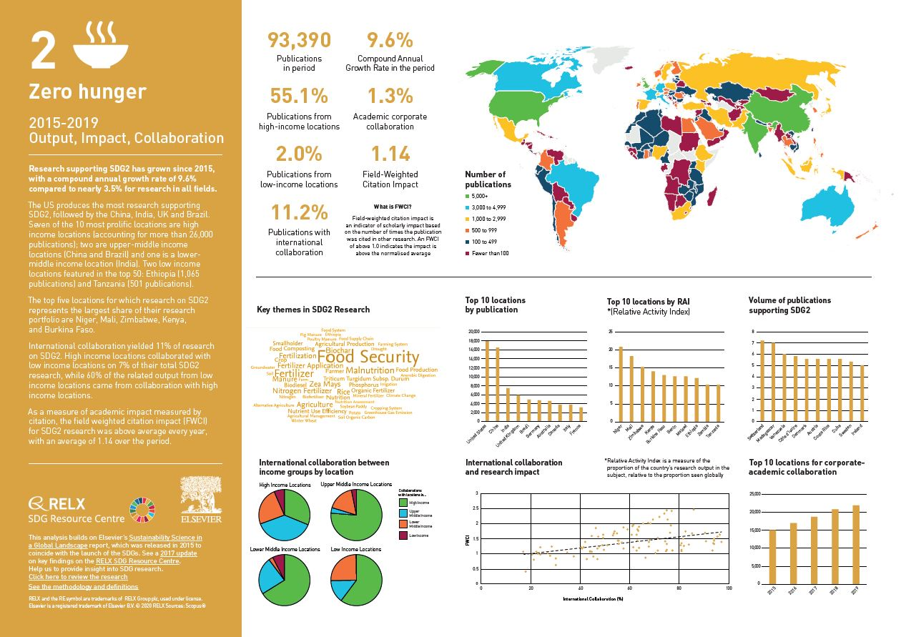

# BhukMukht

### Zero Hunger: A Dream Within Reach

Hunger, a seemingly simple word, carries the weight of immense human suffering. In a world of abundance, the persistent reality of nearly 811 million people chronically undernourished stands as a stark reminder of the inequalities and inefficiencies that plague our food systems.

 

Achieving Zero Hunger, the second Sustainable Development Goal (SDG) established by the United Nations, is not just a noble aspiration, but a moral imperative, demanding a multifaceted approach that tackles the root causes of food insecurity.

Zero Hunger is not merely a dream; it is a tangible possibility within our grasp. By addressing the systemic issues that contribute to food insecurity, investing in sustainable solutions, and fostering global collaboration, we can create a world where everyone has access to the nutritious food they need to thrive. Achieving Zero Hunger is not just about ending hunger; it is about building a more just, equitable, and sustainable future for all.

### Project Setup:

Make sure you have the latest LTS version of NodeJS in your system. Go to terminal and execute the below commands to run the Angular application.

> cd bhuk-mukht

> npm install
 
> ng serve
